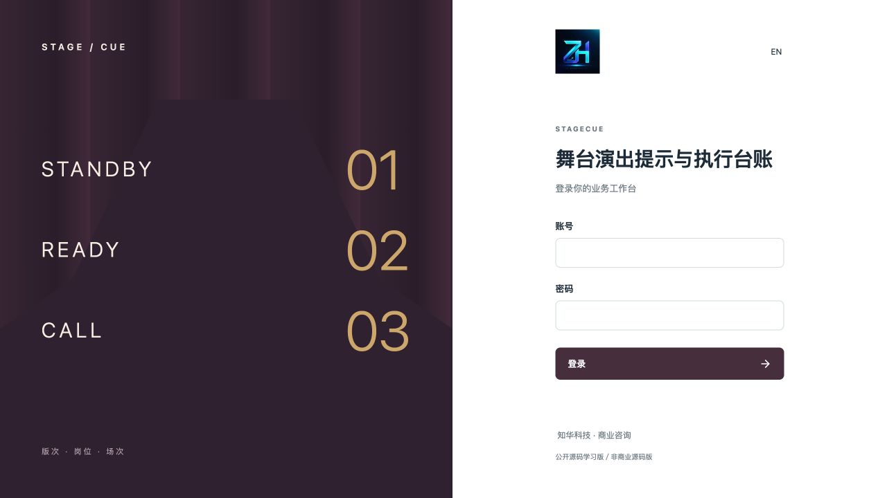
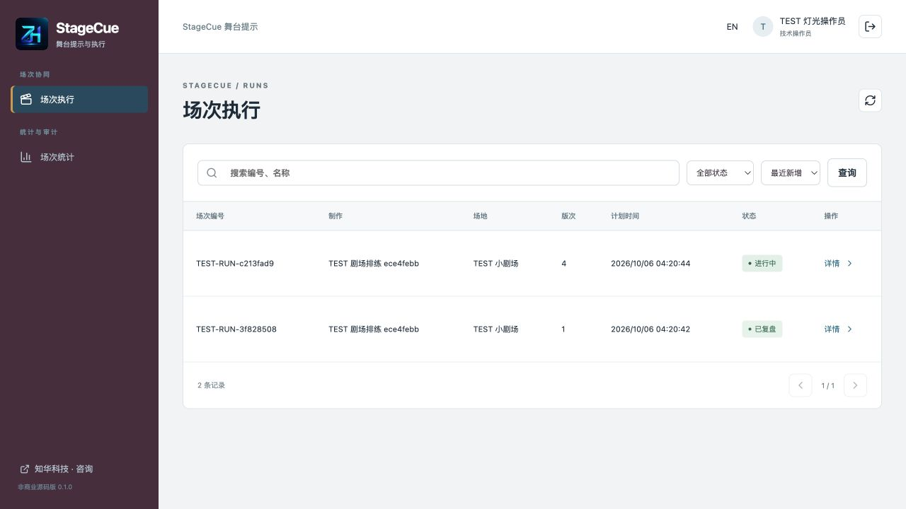
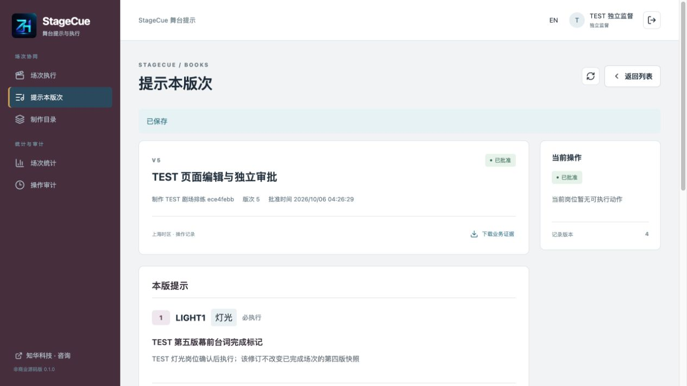
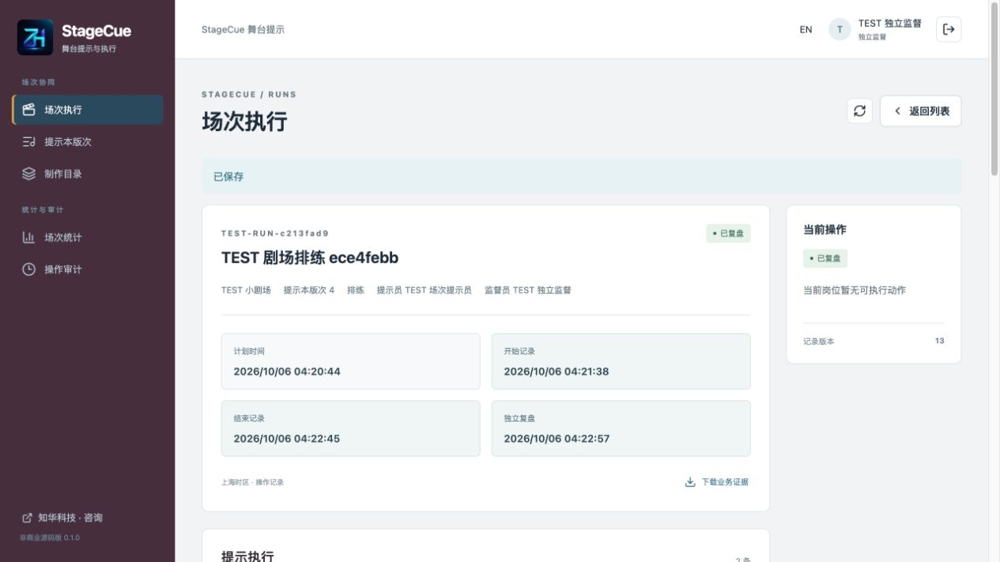
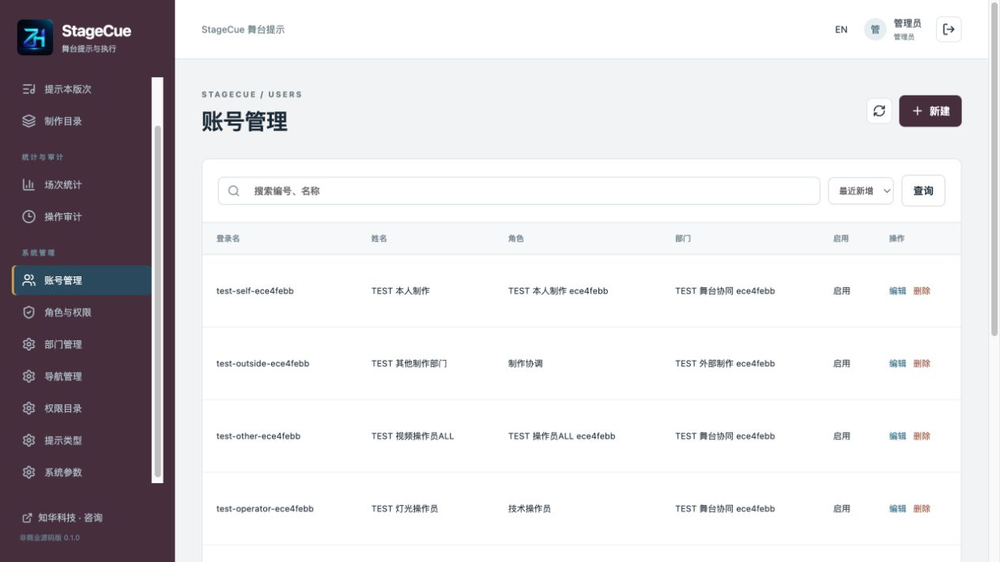
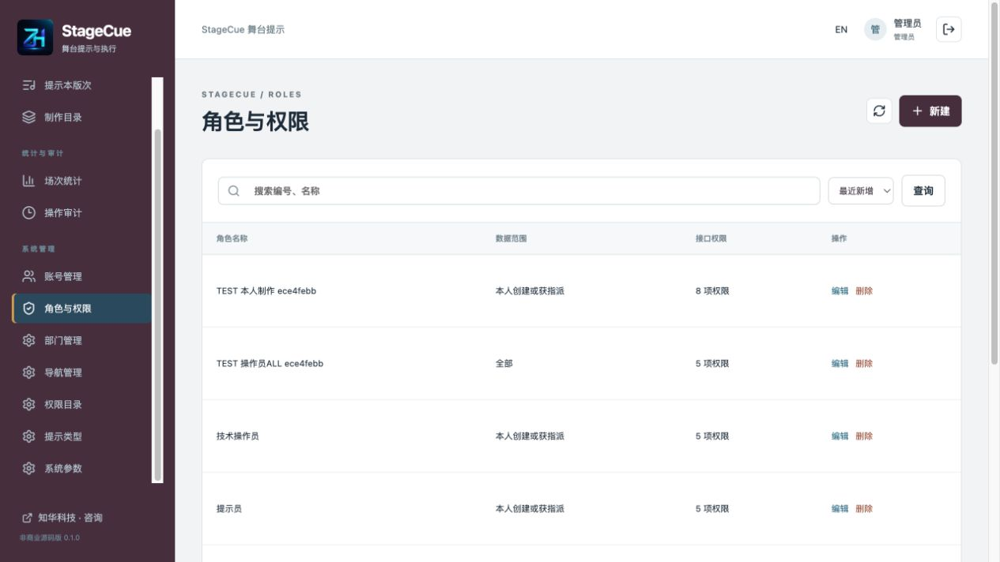
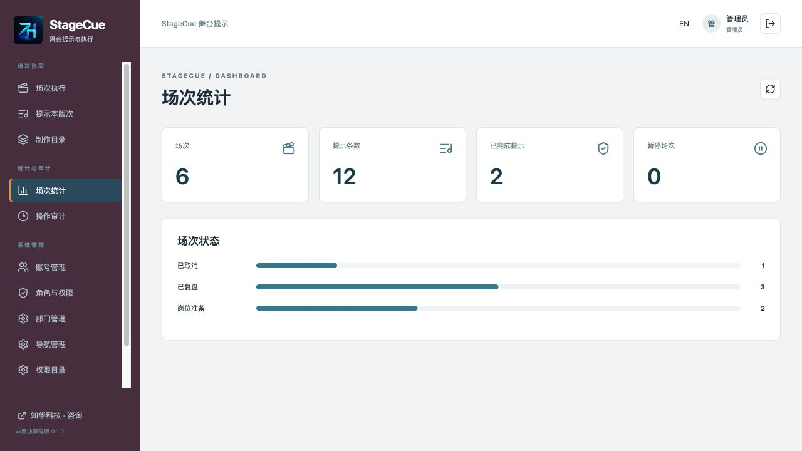
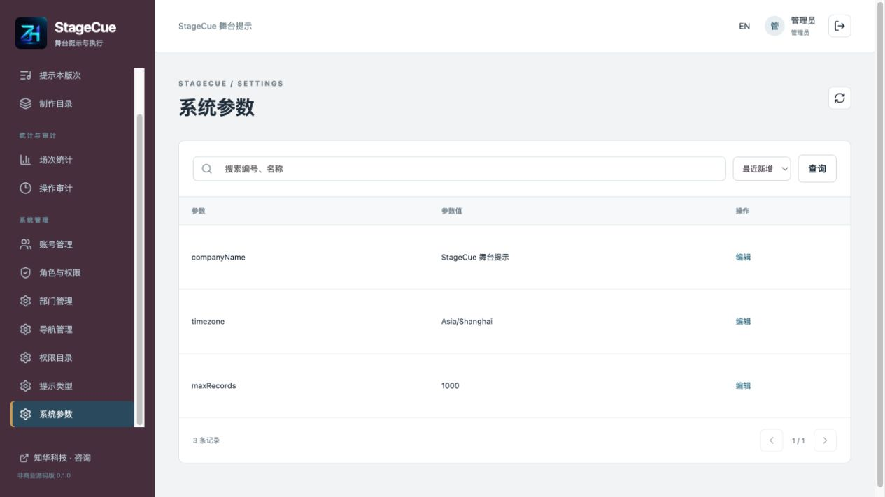
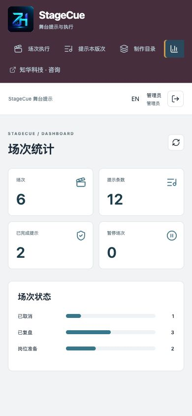
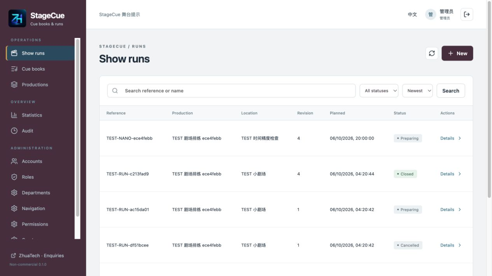

[中文](README.md) | [English](README.en.md)

<div align="center">


# StageCue · 舞台演出提示与执行台账

**公开源码学习版／非商业源码版**

知华科技（上海如静知华信息科技有限公司） · [官网](https://www.zhuatech.cn/)

[操作手册](docs/操作手册.md) · [部署](docs/部署说明.md) · [接口](docs/接口说明.md) · [架构](docs/架构说明.md)
</div>

## 提示本、岗位确认与场次记录

系统采用 Java 21／Spring Boot、Vue 3、MySQL 和 Flyway，提供舞台提示版本审批、岗位指派与执行证据管理。

StageCue 面向剧场、演出制作和排练团队，管理提示本版次、指定岗位、顺序执行和场次复盘。一条提示保存类型、编号、顺序、台词或动作标记、执行说明及是否允许略过。已批准版次冻结，每场复制自己的提示快照；改版不会悄悄改写正在执行的场次。

提示员和操作员分别记录待命、就绪、提示发出和完成。遇到问题时指定成员提出暂停，独立监督员核实处理，提示员记录恢复。所有动作保留版本、操作人、说明、软件记录时间和证据快照。

本版本是人工业务台账。时间表示在系统内登记动作的时刻；不控制灯光、音频、视频、机械、烟火或舞台设备，也不提供现场对讲、实时提示信号、自动播出或安全联锁。现场通信、设备控制及安全程序须使用适用的专业设施。

### 参与岗位

| 岗位 | 可操作内容 |
| --- | --- |
| 制作协调 | 制作目录、提示本修订、场次编排和操作员指派 |
| 独立监督 | 审批未参与编辑的版次；在被指派场次处理暂停和独立复盘 |
| 提示员 | 被指派场次的开始、待命、提示记录、可选提示略过、暂停／恢复、结束与中止 |
| 技术操作员 | 本人提示的版次收悉、就绪、完成回报和所在场次的暂停 |
| 管理员 | 目录、账号、角色、权限、部门、导航、类型、参数；业务操作仍遵守岗位指派与独立审批 |

### 已实现模块

- **制作目录**：编号、名称、负责部门、启停；编号与负责部门创建后不可改变，业务目录保留历史。
- **提示本版次**：顺序号和编号在本版唯一；最多200条，灯光／声音／舞台／视频四类；列入或排除提示、必执行或可选、提交、独立审批、退回、撤回、作废。
- **版次冻结**：批准时保存提示摘要、审核人与时间；所有当前版参与编辑账号不得审批；下一草稿复制最新批准版的有效提示，旧版完整保留。
- **场次快照**：采用创建时最新批准版，复制制作名、提示本名、版次、摘要和所有有效提示；排练／正式场次、场地、计划时间、指定提示员及独立监督员。
- **岗位准备**：每条指派操作员并由本人收悉；重新指派清除本条收悉；编辑准备中场次清除全部收悉；开始时再次检查账号启用和所需权限。
- **逐条执行**：严格按顺序处理第一条未完成提示；提示员记录待命、指定操作员确认就绪、提示员记录提示、本人回报完成；必执行提示不能略过，可选提示需说明。
- **暂停恢复**：运行中指定成员提出暂停；新提示推进被阻止，已提示任务仍可回报事实；指定独立监督员核实，提示员恢复，未提示的待命／就绪回到待执行。
- **结束与复盘**：全部提示完成或合法略过后结束；中止需无已提示未回报任务、无开放暂停；完成和中止分别保留结果，由指定监督员独立复盘；准备中可取消。
- **权限与证据**：15项接口权限、全部／部门／本人范围及明确岗位指派、5个内建角色、12项导航、逐次实时核验、版本冲突和UUID精确重试；详情和无广告JSON导出遵守相同范围。
- **运营与管理**：真实可见场次／提示数量、状态分布、账号启停和密码重置、本人改密码、角色配置、部门、权限说明、导航、提示类型名称、参数、审计、中文英文和窄屏页面。

**尚未实现**：票务、会员课程、演员考勤、场地预约冲突、库存、设备接入、媒体文件与播放、现场对讲、自动提示、离线执行、实时推送、多提示并行／依赖图、已开始场次换版或换岗、提示失败重试及实际时间更正、附件、消息通知、多租户、外部认证、AI。无第三方账号必填配置，无模拟接口或初始化业务演示记录。

## 实际页面

以下为独立测试数据库中的真实运行页面。带 TEST 的记录仅用于验收，不随空库安装初始化。

| 登录 | 操作员工作台 |
| --- | --- |
|  |  |

登录：会话认证进入工作空间。操作员工作台：查看本人被指派的场次与提示。

| 提示本版次 | 场次执行 |
| --- | --- |
|  |  |

提示本版次：维护有序提示与独立审批。场次执行：查看冻结快照，按指定岗位记录顺序执行。

| 账号管理 | 角色与权限 |
| --- | --- |
|  |  |

账号管理：维护账号启用、部门和岗位。角色与权限：配置接口权限与数据范围。

| 场次统计 | 系统参数 |
| --- | --- |
|  |  |

场次统计：查看授权范围内的场次状态与提示数量。系统参数：维护允许调整的名称与容量设置。



手机页面：在窄屏布局中查看提示台账。



英文页面：使用英文操作界面。

## 状态与约束

提示本：草稿／退回 → 待审批 → 已批准；提交人可撤回，独立审核可退回，未批准版可作废。每个制作只能有一个草稿、退回或待审批版。批准后的文本和提示不得编辑。旧批准版不能建立新场次；已有场次继续使用所固定版本。

场次：岗位准备 → 进行中 ⇄ 已暂停 → 待复盘 → 已复盘。中止进入中止待复盘，复盘后仍保留中止结果；准备中可取消。提示员与监督员必须不同，每条操作员也不能兼任该场两岗。

提示：待执行 → 已通知待命 → 操作员就绪 → 已记录提示 → 已回报完成。可选提示在尚未提示时可略过。前序必须已完成或合法略过；一期只提供串行提示。暂停后须重新通知待命和确认就绪，已记录提示和完成事实保留。

所有事实时刻由服务端以UTC微秒记录，界面按上海时区显示。计划时刻是人工输入的预计安排，范围为1970-01-01T00:00:01Z至2038-01-19T03:14:07.999999Z，保存为微秒。按钮可用性仅辅助操作，实际权限、版本和约束由后端复查。

## 工程架构

浏览器通过Nginx同源访问Vue和Spring Boot API；MySQL持久化身份、提示版次、岗位收悉、执行、暂停与证据。Flyway迁移，JPA校验而不自动创建或重写结构。会话放在HttpOnly Cookie中，写操作使用CSRF。

| 层 | 固定版本／配置 |
| --- | --- |
| 后端 | Java21、Maven3.9、Spring Boot4.0.7、Security、JPA、Flyway |
| 数据库 | MySQL8.4、MariaDB JDBC3.5.10、UTC存储 |
| 前端 | Vue3.5.40、Vite8.1.5、Node24.19.0、npm11、Lucide1.48.0 |
| 校验 | Spotless2.43.0／Google Java Format1.24、ESLint10.11、Prettier3.9.9、JUnit／HTTP/JPA、Node test |
| 部署 | Compose v2、Nginx1.29；非root应用；默认仅回环8129 |

```text
backend/src/main/java/cn/zhuatech/stagecue/   提示、场次、权限与管理
backend/src/main/resources/db/migration/    V1身份、V2舞台提示
backend/src/test/                           HTTP/JPA与时间测试
frontend/src/                              双语页面、动作和输入约束
frontend/public/brand/                     原始LOGO和两张微信二维码
scripts/                                   初始化、实际业务验收和发布核查
docs/                                      操作、接口、部署、架构、截图与第三方许可
compose.yaml                               三服务和MySQL持久卷
```

业务表：production、cue_book、book_editor、cue_definition、show_run、cue_execution、run_hold、command_record、business_event。身份表含账号、部门、角色／权限关系、导航、字典、参数及审计。必要外键、唯一索引和版本约束保护业务身份。详见[架构与数据库](docs/架构说明.md)。

空库只初始化总部、admin、5个岗位、15权限、12导航、4提示类型、3参数。默认管理员密码由私有ADMIN_PASSWORD提供，BCrypt12保存，无固定公开密码。已有数据库重启不会重新初始化管理员或业务。

## 运行

### Docker Compose

要求 Docker Desktop／Docker Engine、Compose v2 和 Python 3，具备拉取官方镜像及公开依赖的网络。

```sh
python3 scripts/init-env.py
docker compose -p stagecue config --quiet
docker compose -p stagecue up -d --build --wait
```

访问 **[http://127.0.0.1:8129/](http://127.0.0.1:8129/)**，以admin和本地`.env`内ADMIN_PASSWORD登录。初始化脚本以0600权限创建独立随机密码，不显示密码，不覆盖已有文件。已存在配置直接启动。

端口占用可覆盖：

```sh
WEB_PORT=18129 docker compose -p stagecue up -d --build --wait
```

不停止其他项目容器。容器内通过服务名连接数据库和后端，不向前端写死localhost API。数据库不暴露宿主端口；具备健康等待、命名卷和重启策略。

### 源码运行

Java21／Maven3.9与Node24.19.0以上版本，MySQL8.4可用。为本地后端单独提供DATABASE_URL、DATABASE_USER、DATABASE_CATALOG、DATABASE_PASSWORD、ADMIN_PASSWORD；前端开发代理默认访问本地8080，见vite.config.js。

```sh
mvn -B -f backend/pom.xml spring-boot:run
```

另一个终端，在项目根目录启动前端：

```sh
cd frontend
npm ci
npm run dev
```

不要将密码写入命令历史。配置请通过受控环境注入；源码运行不会自动读取`.env`，Compose会读取。

### 环境变量与持久化

| 名称 | 作用 |
| --- | --- |
| DATABASE_PASSWORD | Compose业务数据库随机密码 |
| MYSQL_ROOT_PASSWORD | MySQL初始化及受控备份管理密码 |
| ADMIN_PASSWORD | 仅空库初始化admin的强密码 |
| WEB_PORT | 宿主前端端口，默认8129 |
| BIND_ADDRESS | 默认127.0.0.1，外网部署按安全策略配置 |
| COOKIE_SECURE | 本机HTTP为false；HTTPS生产设为true |
| DATABASE_URL／DATABASE_USER／DATABASE_CATALOG | 源码运行或外部数据库覆盖，容器默认无需填写 |

健康入口 [http://127.0.0.1:8129/actuator/health](http://127.0.0.1:8129/actuator/health) 只暴露健康状态，正常响应包含 `"status":"UP"`。MySQL卷保留重启后的数据；备份恢复、生产HTTPS和升级步骤见[部署说明](docs/部署说明.md)。不要删除实际业务卷或改写已执行迁移。

## 验证与边界

```sh
mvn -B -f backend/pom.xml spotless:check test package
cd frontend
npm ci
npm run format:check
npm run lint
npm test
npm run build
cd ..
docker compose -p stagecue config --quiet
git diff --check
python3 scripts/release-check.py
```

后端41项（35 HTTP/JPA＋6时间精度与范围），前端10项。覆盖完整业务、独立审批、旧版快照、指派、收悉、顺序、暂停恢复、中止、幂等、并发、范围、实时停用、CSRF及最后管理员保护。集成测试使用独立 H2 和动态生成的随机密码，不能替代真实 MySQL 验收。Docker Maven构建执行全部测试。实际MySQL验收和持久化检查：

```sh
# 仅可销毁的本项目独立测试库，写入TEST业务及随机账号。
python3 scripts/smoke.py --allow-test-writes
# 页面验收后保存被忽略的私有当前快照。
python3 scripts/smoke.py --capture
# 重启或独立恢复后逐响应核对并重新登录所有岗位。
python3 scripts/smoke.py --verify
```

一期为单组织、有界小规模学习实现。production／cue_book／show_run各最多1000，maxRecords可调100～1000；每版最多200条提示，每页最多100。列表先按授权过滤，再在有限结果中排序、分页；写事务使用固定组织锁串行化，未验收大型并发、多实例、高可用、跨组织隔离或实时现场性能。

用户、角色、数据范围和密码散列每次重新核验，改密码使旧会话失效，登录有应用内限速。执行岗位即使设置ALL也只看本人指派提示及关联场次；管理员业务操作也不能代替未指派岗位。更多见[安全说明](SECURITY.md)。

| 现象 | 处理 |
| --- | --- |
| 容器健康失败 | 查本项目mysql／backend日志，核对配置与迁移，保留原卷 |
| 场次不能开始 | 所有提示指派操作员并收悉，核对账号启用和权限 |
| 当前提示不可操作 | 核对本条岗位、前序完成、待命／就绪及场次状态 |
| 暂停后不能恢复 | 指定监督员核实所有开放暂停，再由提示员恢复 |
| 无法审批提示本 | 选择未参与当前版任何编辑的独立账号 |
| 无法结束或中止 | 完成提示；中止前回报所有已提示任务并处理暂停 |
| 旧版不能新建场次 | 使用最新批准版；已有场次快照不自动换版 |
| 修改ADMIN_PASSWORD旧库无变化 | 变量仅初始化，使用本人改密码或管理员重置 |
| 迁移校验失败 | 按可信新增迁移升级，不改写历史或删除实际卷 |

## 部署、升级与备份恢复

升级前暂停业务写入，保留应用镜像版本，并在仓库外的受控目录以 0600 权限保存完整数据库备份。备份包含密码散列与未发布演出资料，不得提交公开仓库。使用新增 Flyway 迁移，不能改写已执行 V1／V2；JPA 只校验结构。

在另一个 Compose 项目、独立数据库卷和不同端口中，先启动 MySQL 并导入备份，再启动对应版本的后端和前端，核对迁移、账号登录、版次摘要、场次快照、岗位、执行与暂停记录，并运行 `scripts/smoke.py --verify` 比对私有验收快照。外网部署需 HTTPS、`COOKIE_SECURE=true`、可信反向代理、网络隔离、最小权限与备份监控；详细步骤见[部署与恢复](docs/部署说明.md)。

`docker compose -p stagecue stop` 保留数据；`down` 删除本项目容器与网络，保留卷。只有明确可丢弃的测试环境才删除数据库卷。

## 授权说明

自有代码采用 [ZhuaTech Non-Commercial Source License 1.0](LICENSE)，仅限个人学习、技术研究与非商业交流。未经上海如静知华信息科技有限公司书面授权不得商用；企业私有化部署、收费交付与服务、源码转售及深度定制须另行取得书面授权。保留署名、官网、版权、许可证和授权联系方式。这是“源码公开、非商业使用”，并非 OSI 标准开源许可。第三方依赖保留各自授权，见 [THIRD_PARTY_NOTICES.md](THIRD_PARTY_NOTICES.md)。软件按现状提供，不宣称未经验证的生产可用性。

## 操作与反馈

流程见[操作手册](docs/操作手册.md)，请求及错误见[接口说明](docs/接口说明.md)。贡献规则和脱敏反馈见[CONTRIBUTING.md](CONTRIBUTING.md)；安全问题通过官网和微信私下联系，不在公开Issue上传凭证、个人数据或未发布演出资料。

## 联系知华科技


本项目由知华科技（上海如静知华信息科技有限公司）提供公开源码学习版本，主要用于个人学习、技术研究与非商业交流。未经书面授权不得商用。企业信息化建设、中小企业数字化转型、中小企业 AI 转型、私有化部署、软件外包、软件项目外包、软件实施、FDE 外包、OPC 技术支持及深度定制开发，请访问知华科技官网 <https://www.zhuatech.cn/>，或添加微信 zhuatech、zhuatech2 咨询。

官网：[https://www.zhuatech.cn/](https://www.zhuatech.cn/)。商业授权、定制开发、部署与系统集成咨询微信：**zhuatech**、**zhuatech2**。

| 微信 zhuatech | 微信 zhuatech2 |
| --- | --- |
|  |  |

商业授权或深度定制开发请联系知华科技。
